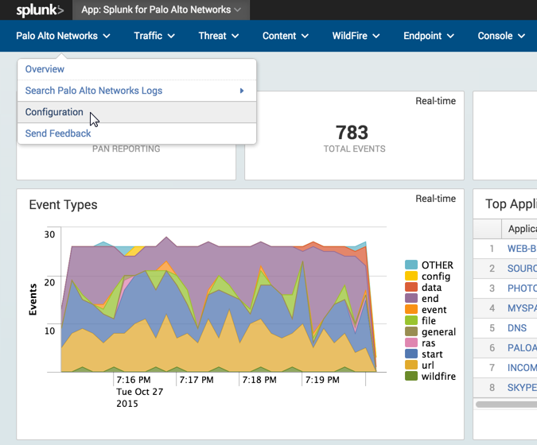
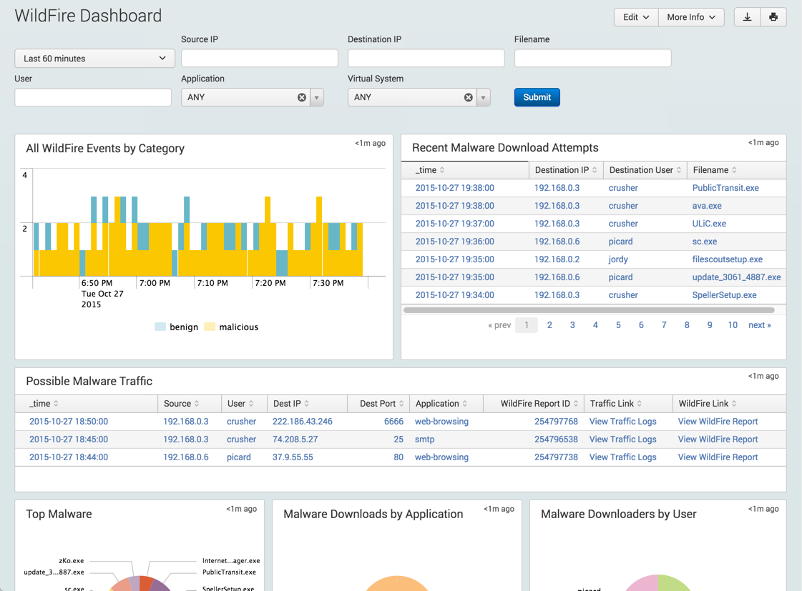
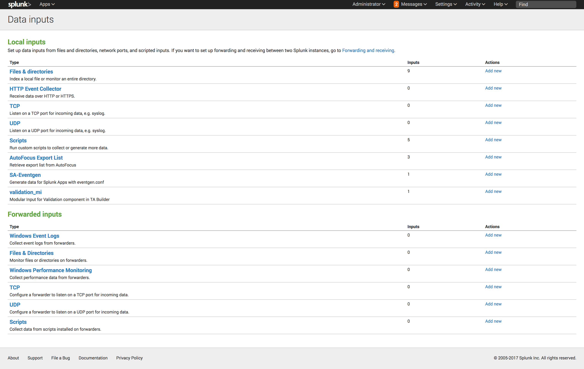

.. _advancedfeatures:

Advanced Features
=================

.. _wildfire:

WildFire
--------

The Palo Alto Networks App can download a behavioral fingerprint of any
malware seen by WildFire on your network in the form of a `WildFire report`_.
This report is indexed by Splunk and can be used for advanced correlations
to detect malicious behavior and indicators of compromise.

Two steps are needed to enable WildFire report indexing:

**Step 1: Add the Wildfire API key to the Palo Alto Networks App configuration**

During the :ref:`initial setup <initialsetup>`, provide the WildFire API key.
The WildFire API key is found in the WildFire portal on the **Account** tab:
https://wildfire.paloaltonetworks.com

To access the configuration screen after initial setup, navigate to the **Palo
Alto Networks** menu and click **Configuration**.



**Step 2: Send WildFire logs to Splunk from a Firewall or Panorama**

To send WildFire logs to Splunk, you must configure the firewall (or
Panorama) with a syslog server, a log forwarding profile that includes
WildFire logs, and a security rule with a the log forwarding profile and a
WildFire profile attached. Use the following links to configure WildFire
logging:

* `Configure syslog and log forwarding profiles`_
* `Configure WildFire (PAN-OS 7.0)`_
* `Configure WildFire (PAN-OS 6.1 and earlier)`_

.. note:: The WildFire API key won't be used unless there are WildFire logs
   coming from the Firewall or Panorama. The WildFire API key is leveraged to
   get more context around the syslogs from the firewall.

After you've completed both steps, you should see the WildFire dashboard
start to populate with data. If not, verify the WildFire and logging
configuration on the firewall.



   WildFire dashboard with data

.. _WildFire report:
   https://www.paloaltonetworks.com/documentation/70/wildfire/wf_admin/monitor-wildfire-activity/wildfire-analysis-reports-close-up.html
.. _Configure syslog and log forwarding profiles:
   https://www.paloaltonetworks.com/documentation/70/pan-os/pan-os/monitoring/configure-syslog-monitoring.html
.. _Configure WildFire (PAN-OS 7.0):
   https://www.paloaltonetworks.com/documentation/70/wildfire/wf_admin/submit-files-for-wildfire-analysis/forward-files-for-wildfire-analysis.html
.. _Configure WildFire (PAN-OS 6.1 and earlier):
   https://www.paloaltonetworks.com/documentation/61/wildfire/wf_admin/wildfire-cloud-file-analysis/forward-samples-to-the-wildfire-cloud.html
.. _Customize your WildFire logs further:
   https://www.paloaltonetworks.com/documentation/70/wildfire/wf_admin/monitor-wildfire-activity/configure-wildfire-submissions-log-settings.html

.. _syncuserid:

Sync user login events with User-ID
-----------------------------------

The Palo Alto Networks firewall will inform Splunk of the user generating
each connection or event via the syslogs it sends to Splunk.  This assumes
that the firewall is getting the login information from AD or some other
authentication system, to know what user is logged into the device
generating the traffic.

If authentication logs are being indexed by Splunk, then Splunk can synchronize
knowledge of where users are logged in with the firewall. For example, if
Splunk is receiving a radius authentication log where 'user' is the field
containing the user who authenticated, and 'ip' is the field containing the
IP address where the user logged in, then you can map the user to the ip on
the firewall.

In this situation, it is often preferred to use Splunk syslog forwarding to
a User-ID agent or firewall because it is more efficient.  But there are
some cases where the user and IP are not in the same log.  For example, if
an authentication log contains the user and MAC address, and the DHCP log
contains the MAC address and IP.  A correlation must be done on the MAC
address to know which IP the user logged in from. In this situation, the
panuserupdate command is the preferred solution.

See also:
  * :ref:`userid`
  * Searchbar Command: :ref:`panuserupdate`

.. _dag:

Share context with Dynamic Address Groups
-----------------------------------------

Tagging an IP address means setting metadata or context on the firewall for
that IP, which causes it to be added to corresponding Dynamic Address
Groups in the firewall security policy.  For example, you could create a
rule in the security policy that blocks any IP address with the tag
'bad-actor'. Initially, no IP addresses would be blocked, but you can
create a search in Splunk for criteria that represents a problem device,
and trigger a tagging of that IP address with the 'bad-actor' tag.  The
firewall would add the IP address to the Dynamic Address Group in the
policy automatically and begin blocking the IP.

Blocking a bad actor is just the beginning, and you aren't limited to allow
or deny as your options.  You could tag an IP address for additional
scrutiny by the Threat Prevention engine, or as a known trusted server to
be given additional permissions.  The behaviors are defined by your
security policy, and how you treat IP addresses with specific tags.

**See also:**

  Command reference: :ref:`pantag`

Webinar that explains the concept of automated remediation and demonstrates
a case study of a real customer using this technique with Splunk and Palo
Alto Networks today:

  Webinar: `Defeat APT with Automated Remediation in Splunk`_

Video from a session at Ignite 2015 explains Dynamic Address Groups in more
detail with several use cases including asset management:

  Video: `Applying Order to Computing Chaos`_

.. _Applying Order to Computing Chaos:
    https://www.youtube.com/watch?v=Kv0SR9KLDj4

.. _ipclassification:

IP Classification
-----------------

Classify IP addresses in Splunk by any criteria relevant to your environment.
IP ranges can be designated as `DMZ`, `datacenter`, `VMware`, `serverfarm`,
`webtier`, or any other relevant keyword to help distinguish and classify a
group of IP addresses during a search.

Classifications will show up in the ``src_class`` and ``dest_class`` [#f1]_ fields.

Classifications are set in the lookup file ``ip_classifictions.csv`` [#f2]_.
Add subnets and their classification to the ``ip_classifications.csv`` file, one
per line.

For example::

    cidr,classification
    10.0.0.0/8,private
    172.16.0.0/12,private
    192.168.0.0/16,private
    10.5.5.0/24,dmz
    10.240.0.0/16,datacenter1
    192.168.5.0/24,partner-mpls

More specific entries take precedence.

Now look for the classifications in the ``src_class`` and ``dest_class``
fields during a search that includes these IP address ranges.

.. _sanctioned_saas:

Un/Sanctioned SaaS Detection
----------------------------

*Added in App version 5.0*

Classify SaaS applications as sanctioned or unsanctioned for your
organization. This designation is used in searches using the Splunk searchbar
and to separate information in the App's SaaS Dashboard.

SaaS applications are designated as sanctioned in the lookup file
``sanctioned_saas.csv`` in the Splunk_TA_paloalto Add-on.

Add each sanctioned SaaS app in the lookup file, one per line.  For example::

    app,sanctioned_saas
    paloalto-wildfire-cloud,yes
    boxnet,yes
    dropbox,yes
    gmail-enterprise,yes
    skype,yes
    facebook-base,yes
    gmail-chat,yes

Sanctioned designation is found in the field ``app:is_sanctioned_saas``.

For a list of all SaaS applications, visit `Applipedia`_ and under the
`Characteristics` header, click `SaaS`.

.. _Applipedia: https://applipedia.paloaltonetworks.com/

.. _remediation:

Automated Remediation
---------------------

Use the :ref:`pantag` command to share context from Splunk to the firewall
for automated remediation.

This webinar explains the concept of automated remediation and demonstrates
a case study of a real customer using this technique with Splunk and Palo
Alto Networks today:

Webinar: `Defeat APT with Automated Remediation in Splunk`_

.. _Defeat APT with Automated Remediation in Splunk:
    https://www.paloaltonetworks.com/resources/webcasts/defeat-apts-improve-security-posture-real-time.html

.. _contentpack:

Update metadata from content packs
----------------------------------

*Added in App version 5.0*

The Palo Alto Networks Add-on (TA) comes with two lookup files with metadata
about applications and threat signatures called ``app_list.csv`` and
``threat_list.csv``, respectively. These lookup tables are responsible for
populating the app:xyz and threat:xyz fields used in the dashboards and
displayed during a search.

The lookup table files are updated with each TA release, but can get out of
date between releases. To keep the files up to date, they can be updated
dynamically from the content pack metadata in your firewall or Panorama.
This is done by creating a saved search inside the TA to periodically pull
the metadata from the firewall or Panorama and update the lookup tables.

Create the following saved searches in the TA, by creating the file:
``$SPLUNK_HOME/etc/apps/Splunk_TA_paloalto/local/savedsearches.conf``
::

    [Palo Alto Networks - Retrieve ContentPack Apps]
    cron_schedule = 5 0 * * 6
    dispatch.earliest_time = -1m@m
    displayview = flashtimeline
    enableSched = 1
    realtime_schedule = 0
    request.ui_dispatch_view = flashtimeline
    search = | pancontentpack <IP-or-hostname> apps | outputlookup createinapp=true app_lookup
    disabled = 0

    [Palo Alto Networks - Retrieve ContentPack Threats]
    cron_schedule = 10 0 * * 6
    dispatch.earliest_time = -1m@m
    displayview = flashtimeline
    enableSched = 1
    realtime_schedule = 0
    request.ui_dispatch_view = flashtimeline
    search = | pancontentpack <IP-or-hostname> threats | outputlookup createinapp=true threat_lookup
    disabled = 0

Set ``<IP-or-hostname>`` to the IP or hostname of your Firewall or Panorama.
Ensure you set the credentials for this device in the
:ref:`App configuration <initialsetup>`. This example updates the lookup
tables every Saturday at 12:05 AM for apps and 12:10 AM for threats.
Change the cron_schedule to your desired update schedule.

.. note:: The Palo Alto Networks App version 5.0 or higher must be installed for the
   lookup table update to work. But the saved searches must be created in
   the TA, not the App.

   If using a custom admin role on the firewall, it must have **Configuration**
   permissions for the **XML API**.  See :ref:`initialsetup` in the :ref:`gettingstarted`
   Guide.

.. rubric:: Footnotes

.. [#f1] The field is called ``dst_class`` in App versions before 5.0
.. [#f2] Starting in App version 5.0, the ``ip_classifications.csv`` file is located in the Splunk_TA_paloalto Add-on.  Before 5.0, it is in the SplunkforPaloAltoNetworks App.


.. _external_search_autofocus:

External Search for AutoFocus
-----------------------------

External Search can be used with AutoFocus **Remote Search** feature. Remote search is a feature in AutoFocus providing a way to search for IOC’s in an external system. The Palo Alto Networks Splunk App can receive a search request from AutoFocus and provide log events that match the search criteria.

.. note:: This feature is only available on Palo Alto Networks App and requires access to AutoFocus.

Setting up remote search and how to use it in AutoFocus is documented on the Palo Alto Networks Website and will not be covered here. The values needed in ``Step 3`` of the documentation are provided here along with the link to the documentation.

* `Setup AutoFocus remote search`_

* Values to be used in Step 3 of the doc
    System Type: ``Custom``

    Address: ``https://<SPLUNK SERVER>:8000/en-US/app/SplunkforPaloAltoNetworks/external_search?search=``

.. _Setup AutoFocus remote search:
   https://www.paloaltonetworks.com/documentation/autofocus/autofocus/autofocus_admin_guide/autofocus-search/set-up-remote-search

   
.. _external_search_log_link:

External Search for Log Link
----------------------------
Palo Alto Networks Firewall has a feature called Log Link, which allows you to cross launch into an external search from the Firewall UI. This feature can be used with the Palo Alto Networks Splunk App External Search page. 

.. note:: This feature is only available on Palo Alto Networks App and requires access to PAN-OS CLI.


.. _Palo Alto Networks Live:
  https://live.paloaltonetworks.com/t5/Configuration-Articles/How-does-the-Log-Link-Feature-Work/ta-p/52298

Example CLI command
::

  set deviceconfig system log-link Splunk.Dst url http://<SPLUNK SERVER>:8000/en-US/app/SplunkforPaloAltoNetworks/external_search?search=(dest_ip%20eq%20'{dst}')

Other possible fields to search
::

  (dest_ip%20eq%20'{dst}')
  (src_ip%20eq%20'{src}')
  (dest_port%20eq%20'{dport}')
  (src_port%20eq%20'{sport}')
  (protocol%20eq%20'{proto}')

.. _autofocus_export_list:

AutoFocus Export List
---------------------

With the Palo Alto Networks Splunk Add-on an AutoFocus export list can be added 
as a modular input in Splunk. The modular input utilizes AutoFocus's REST API 
to periodically sync an Export List from AutoFocus. The list of artifacts are 
stored in the KVStore and can be accessed via `inputlookup` macros. This data 
can then be used to correlate against other logs.

Two steps are needed to enable AutoFocus export list syncing:

**Step 1: Add the AutoFocus API key to the Add-on configuration**

During the :ref:`initial setup <initialsetup>`, provide the AutoFocus API key.
The AutoFocus API key is found in the AutoFocus portal on the **Settings** tab:
https://autofocus.paloaltonetworks.com

To access the configuration screen after initial setup, navigate to the **Palo
Alto Networks** menu and click **Configuration**.


**Step 2: Add AutoFocus Export List to Splunk from a Data Input**

* Learn more about `creating an Export List`_

To retrieve the export list from AutoFocus, you must configure a data input. From the Settings menu click on `Data Inputs`. Under Local inputs types select `AutoFocus Export List` and add a new list.  

Give your new data input a name by entering it in the ``Name`` field.

Set the name of your export list in the ``label`` field. This field must match the export list name from AutoFocus.



Verify the data is being synced by running a search ``| `pan_autofocus_export```

.. note:: A pipe(``|``) is always used in front of the macro to do a lookup search.

.. _creating an Export List:
   https://www.paloaltonetworks.com/documentation/70/wildfire/wf_admin/monitor-wildfire-activity/wildfire-analysis-reports-close-up.html`

**Macros**
There are several new macros that can be used to correlate a search with the artifacts imported from the AutoFocus Export List.

```| pan_autofocus_export``` - A macro to search on all export lists. This will return all entries from all AutoFocus inputs. 

The remaining macros requires one argument. Set the ``label`` of the export list you want to search against. Each macro is separated by the artifact types. 

```| pan_autofocus_export_dns(label)```

```| pan_autofocus_export_connection(label)```

```| pan_autofocus_export_registry(label)``` 

```| pan_autofocus_export_file(label)```

```| pan_autofocus_export_process(label)```