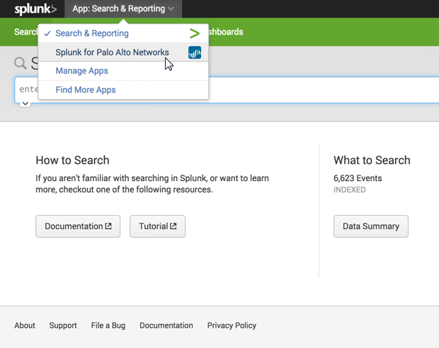
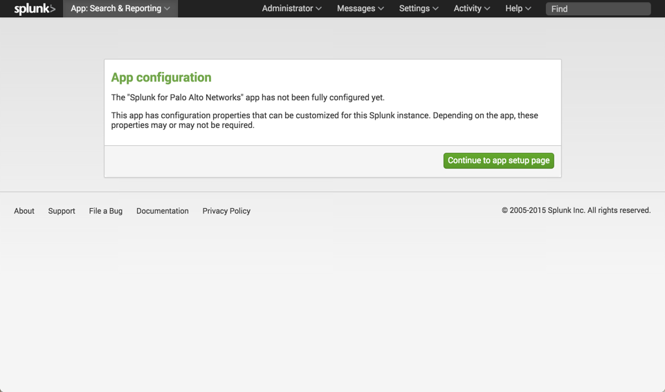

.. _gettingstarted:

Getting Started
===============

Step 1: Install the App and Add-on
----------------------------------

The Palo Alto Networks Splunk App and Add-on are designed to work together,
and with Splunk Enterprise Security if available.

This table indicates when the Add-on (TA) is necessary:

+---------------+--------------------------------------+
| App           | Add-on (TA)                          |
+===============+======================================+
| Version 5.0   | Splunk_TA_paloalto v3.5.0 or higher  |
+---------------+--------------------------------------+
| Version 4.x   | No TA required                       |
+---------------+--------------------------------------+
| Version 3.x   | No TA required                       |
+---------------+--------------------------------------+

.. admonition:: The TA called TA_paloalto is deprecated and should be
   replaced with Splunk_TA_paloalto.

* `Palo Alto Networks App <http://splunkbase.splunk.com/app/491>`_
* `Palo Alto Networks Add-on <http://splunkbase.splunk.com/app/491>`_

Install the Palo Alto Networks App by downloading it from the App homepage,
or by installing it from within Splunk.

.. image:: _static/download_app.png

.. note:: The Palo Alto Networks App and Add-on must be installed on all
   Searchheads, Indexers, and Heavy Forwarders.

.. _initialsetup:

Step 2: Initial Setup
---------------------

   Select the Palo Alto Networks App from the App menu at the top.

   The first time you run the App, you are prompted to complete the initial
   setup.

.. image:: _static/setup.png

Enter the credentials for your Firewall or Panorama. The
credentials are encrypted by Splunk and used for the
following features:

* :ref:`syncuserid`
* :ref:`dag`
* :ref:`contentpack`

Enter a WildFire API key. Splunk can
:ref:`index malware behavioral fingerprints <wildfire>` by downloading malware
reports from the WildFire cloud. Get your WildFire API key from the
WildFire portal in the **Accounts** tab:  https://wildfire.paloaltonetworks.com

.. admonition:: This feature is only available for WildFire subscribers

See also:
  * :ref:`wildfire`

Step 3: Create the Splunk input
-------------------------------

Syslogs are sent to Splunk using the following protocols:

========================   ================
Product                    Syslog Protocols
========================   ================
Next generation Firewall   UDP, TCP, or SSL
Panorama                   UDP, TCP, or SSL
Traps Endpoint Security    UDP
========================   ================

Use the GUI to create a Data Input, or create it in inputs.conf. This
document will explain how to create the Data Input using inputs.conf.

First, create the inputs.conf in the correct directory for your version:

=========== =====================================================================
App version inputs.conf location
=========== =====================================================================
5.x         $SPLUNK_HOME/etc/apps/Splunk_TA_paloalto/local/inputs.conf
3.x or 4.x  $SPLUNK_HOME/etc/apps/SplunkforPaloAltoNetworks/local/inputs.conf
=========== =====================================================================

.. note:: The ``local`` directory is not created during installation, so you
   may need to create it.

Add the following lines to the ``inputs.conf`` file.  This examples uses the
default syslog port UDP 514.  Change the port as needed. ::

    ## App version 5.x or Add-on

    [udp://514]
    sourcetype = pan:log
    no_appending_timestamp = true

    ## App version 4.x and 3.x

    [udp://514]
    index = pan_logs
    sourcetype = pan_log
    no_appending_timestamp = true

The ``index``, ``sourcetype``, and ``no_appending_timestamp`` setting must be set
exactly as in the example. For TCP or SSL syslogs, remove the
``no_appending_timestamp`` setting.

.. note:: Firewalls, Panorama, and Traps ESM can all send logs to the same
   data input port.

Step 4: Configure the Firewall or Endpoint Security Manager
-----------------------------------------------------------

There are two ways to send logs from a Next generation Firewall to Splunk:

1. All firewalls syslog directly to Splunk
2. All firewalls log to Panorama, then Panorama syslogs to Splunk

The Palo Alto Networks syslog documentation describes each option in detail:

**Firewall and Panorama syslog to Splunk:**
https://www.paloaltonetworks.com/documentation/70/pan-os/pan-os/monitoring/use-external-services-for-monitoring.html

**Traps Endpoint Security Manager (ESM) syslog to Splunk:**
https://www.paloaltonetworks.com/documentation/32/endpoint/endpoint-admin-guide/reports-and-logging/enable-external-reporting-using-the-esm-console.html
