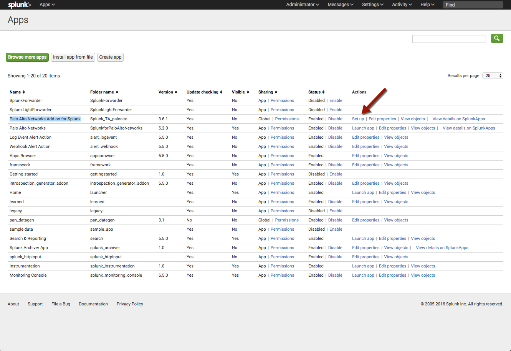
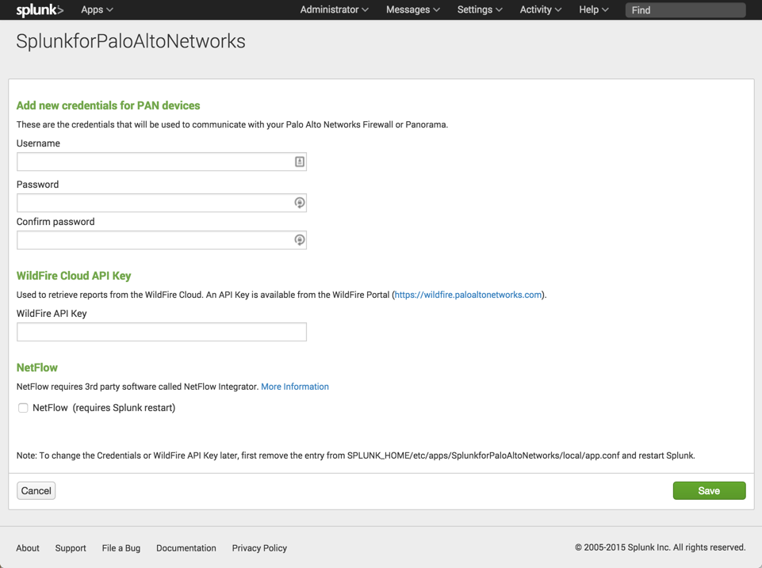
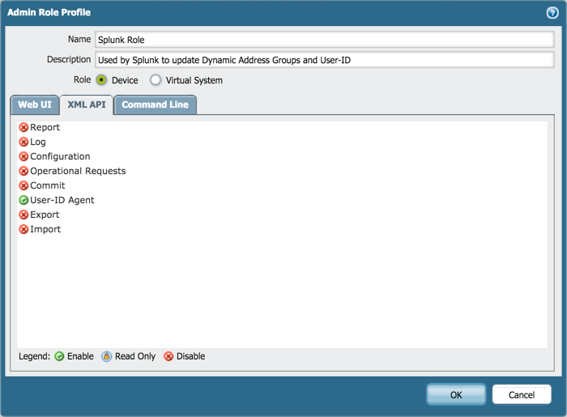

.. _gettingstarted:

Getting Started
===============

Step 1: Install the App and Add-on
----------------------------------

* `Palo Alto Networks App <https://splunkbase.splunk.com/app/491>`_
* `Palo Alto Networks Add-on <https://splunkbase.splunk.com/app/2757>`_

If upgrading to App 4.1 or 5.0, read the :ref:`Upgrade Guide <upgrade>`.

The Palo Alto Networks Splunk App and Add-on are designed to work together,
and with Splunk Enterprise Security if available. The Add-on can be used
with or without the App.

.. note:: The Palo Alto Networks App and Add-on must be installed on all
   Searchheads, Indexers, and Heavy Forwarders. Do not install on
   Universal Forwarders.

Compatibility between App and Add-on (TA):

+---------------+--------------------------------------+
| App           | Add-on (TA)                          |
+===============+======================================+
| Version 5.3   | Splunk_TA_paloalto 3.7.0 or higher   |
+---------------+--------------------------------------+
| Version 5.2   | Splunk_TA_paloalto 3.6.x             |
+---------------+--------------------------------------+
| Version 5.1   | Splunk_TA_paloalto 3.6.x             |
+---------------+--------------------------------------+
| Version 5.0   | Splunk_TA_paloalto 3.5.x or 3.6.x    |
+---------------+--------------------------------------+
| Version 4.x   | No Add-on required                   |
+---------------+--------------------------------------+
| Version 3.x   | No Add-on required                   |
+---------------+--------------------------------------+

.. note:: The Add-on (TA) called TA_paloalto is deprecated and should be
   replaced with Splunk_TA_paloalto.

Advanced Endpoint Security (Traps) support:

+------------------------+--------------------------------------+
| Traps                  | App / Add-on                         |
+========================+======================================+
| Traps 3.3.2 and higher | Add-on 3.6.0 and higher              |
+------------------------+--------------------------------------+
| Traps 3.3.0 and 3.3.1  | Not supported                        |
+------------------------+--------------------------------------+
| Traps 3.2.x            | App 4.2 or Add-on 3.5.x with App 5.0 |
+------------------------+--------------------------------------+

Install the Palo Alto Networks App by downloading it from the App homepage,
or by installing it from within Splunk.

.. figure:: _static/download_app.png

   Downloading the App and Add-on from within Splunk Enterprise.

.. note:: In a **single node** environment, the latest Add-on (TA) is installed
   automatically by the App, and does not need to be installed
   separately. In **clustered** environments, the App and Add-on should
   be installed separately. Both can be installed by a deployment server.

.. _initialsetup:

Step 2: Initial Setup
---------------------

To use Adaptive Response, modular alerts/actions, or the custom searchbar commands,
please configure the Add-on using the set up screen.

To configure when the App is installed, navigate to the App, click the
**Palo Alto Networks** menu in the top left of the App, and
click **Configuration**.

To configure when the App is not installed, navigate to the Splunk App Manager.
Find the Add-on (Palo Alto Networks Add-on for Splunk) in the list and on the
right side click **Set up**.

**Firewall Credentials**

.. note:: Only a single Firewall credential can be added. 

Enter the credentials for your Firewall or Panorama. The
credentials are encrypted by Splunk and used for the
following features:

* :ref:`syncuserid`
* :ref:`dag`
* :ref:`contentpack`

Optionally, you can create a user for Splunk on the firewall or Panorama,
and reduce the user's role to just what is required. To use :ref:`pantag`,
:ref:`panuserupdate`, or any the Dynamic Address Group Adaptive Response action,
the firewall admin must have **User-ID Agent** permissions in the **XML API** tab.
To use :ref:`pancontentpack`, the firewall admin must have **Configuration**
permissions in the **XML API** tab.

   Firewall permissions required for App special features

**Wildfire API Key**

Enter a WildFire API key. Splunk can
:ref:`index malware behavioral fingerprints <wildfire>` by downloading malware
reports from the WildFire cloud. Get your WildFire API key from the
WildFire portal in the **Accounts** tab:  https://wildfire.paloaltonetworks.com

See also:
  * :ref:`wildfire`

.. note:: The WildFire indexing feature is only available for WildFire
   subscribers

**AutoFocus API Key**

Enter a AutoFocus API key. Splunk can retrieve export lists created in AutoFocus.
Get your AutoFocus API key from the **Settings** tab: https://autofocus.paloaltonetworks.com

See also:

.. note:: If none of these features are desired, leave the fields blank and
   click **Save** to continue.

.. _datainput:

Step 3: Create the Splunk data input
------------------------------------

Syslogs are sent to Splunk using the following protocols:

==============================  ================
Product                         Syslog Protocols
==============================  ================
Next generation Firewall        UDP, TCP, or SSL
Panorama                        UDP, TCP, or SSL
Traps Endpoint Security >= 3.3  UDP, TCP, or SSL
Traps Endpoint Security 3.2     UDP
==============================  ================

Use the GUI to create a Data Input, or create it in inputs.conf. This
document will explain how to create the Data Input using inputs.conf.

First, create the inputs.conf in the correct directory for your version:

=============  =====================================================================
App version    inputs.conf location
=============  =====================================================================
5.x w/ Add-on  $SPLUNK_HOME/etc/apps/Splunk_TA_paloalto/local/inputs.conf
3.x or 4.x     $SPLUNK_HOME/etc/apps/SplunkforPaloAltoNetworks/local/inputs.conf
=============  =====================================================================

.. note:: The ``local`` directory is not created during installation, so you
   may need to create it.

Add the following lines to the ``inputs.conf`` file.  This examples uses the
default syslog port UDP 514.  Change the port as needed. ::

    ## App version 5.x or Add-on

    [udp://514]
    sourcetype = pan:log
    no_appending_timestamp = true

    ## App version 4.x and 3.x

    [udp://514]
    index = pan_logs
    sourcetype = pan_log
    no_appending_timestamp = true

The ``index``, ``sourcetype``, and ``no_appending_timestamp`` setting must be set
exactly as in the example. For TCP or SSL syslogs, remove the
``no_appending_timestamp`` setting.

.. note:: Firewalls, Panorama, and Traps ESM can all send logs to the same
   data input port.

Step 4: Configure the Firewall or Endpoint Security Manager
-----------------------------------------------------------

There are two ways to send logs from a Next generation Firewall to Splunk:

1. All firewalls syslog directly to Splunk
2. All firewalls log to Panorama, then Panorama syslogs to Splunk

The Palo Alto Networks syslog documentation describes each option in detail:

**Firewall and Panorama syslog to Splunk:**
https://www.paloaltonetworks.com/documentation/70/pan-os/pan-os/monitoring/use-external-services-for-monitoring.html

**Traps Endpoint Security Manager (ESM) syslog to Splunk:**
https://www.paloaltonetworks.com/documentation/33/endpoint/endpoint-admin-guide/reports-and-logging/forward-logs-to-a-syslog-server

.. note:: Traps logs must be in CEF format (CEF is the default on ESM)

.. _test:

Step 5: Test the configuration
------------------------------

The easiest way to test that everything is working is to configure the
firewall to syslog all config events. On the firewall or Panorama, navigate to
the **Device** tab, then **Log Settings**.  Enable config logs and commit
the configuration.

Now, make any configuration change and the firewall to produce a
config event syslog. You don't have to commit the change for the syslog to
be produced; any uncommitted change to the configuration produces a log.

Verify the log reached Splunk by going to the Palo Alto Networks App
click Search in the navigation bar, and enter::

    eventtype=pan_config

.. note:: Use the default Search app if using just the
   Palo Alto Networks Add-on.

If Splunk is getting the syslogs from the firewall and parsing them
correctly, then you'll see the config event syslogs show up here from the
changes you made on the firewall configuration.

If you don't see the syslog, verify the steps above or try the
:ref:`Troubleshooting Guide <troubleshoot>`.