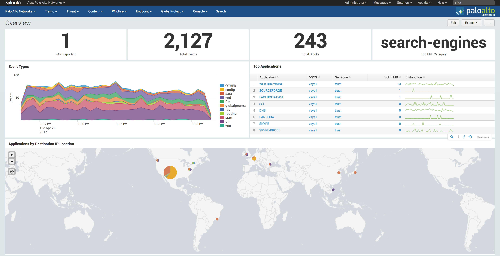

Overview
========

About the App
-------------

Palo Alto Networks and Splunk have partnered to deliver an advanced security
reporting and analysis tool. The collaboration delivers operational reporting
as well as simplified and configurable dashboard views across Palo Alto
Networks family of next-generation firewalls.

Splunk for Palo Alto Networks leverages the data visibility provided by
Palo Alto Networks's firewalls and endpoint protection with Splunk's extensive
investigation and visualization capabilities to deliver an advanced
security reporting and analysis tool. This app enables security analysts,
administrators, and architects to correlate application and user activities
across all network and security infrastructures from a real-time and
historical perspective.

Complicated incident analysis that previously consumed days of manual and
error-prone data mining can now be completed in a fraction of the time,
saving not only manpower but also enabling key enterprise security
resources to focus on critical, time-sensitive investigations.

**App Author**: Brian Torres-Gil -- `email <mailto:btorres-gil@paloaltonetworks.com>`_ -
`splunkbase <https://answers.splunk.com/users/183886/btorresgil.html>`_ -
`github <https://github.com/btorresgil>`_

Splunk Version Compatibility
----------------------------

* Splunk 6 --> Palo Alto Networks App 4.x or 5.x
* Splunk 5 --> Palo Alto Networks App 3.x

Features
--------

.. todo:: Features

.. todo:: Difference between App and TA

Install from Github
-------------------

This app is available on `SplunkBase <http://splunkbase.splunk.com/app/491>`_
and `Github <https://github.com/PaloAltoNetworks-BD/SplunkforPaloAltoNetworks>`_.
Optionally, you can clone the github repository to install the app. Please
feel free to submit contributions to the app using pull requests on github.

From the directory ``$SPLUNK_HOME/etc/apps/``, type the following command::

    git clone https://github.com/PaloAltoNetworks-BD/SplunkforPaloAltoNetworks.git SplunkforPaloAltoNetworks

