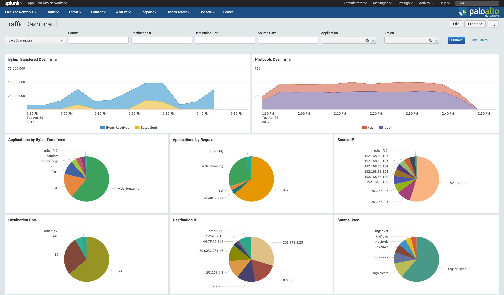
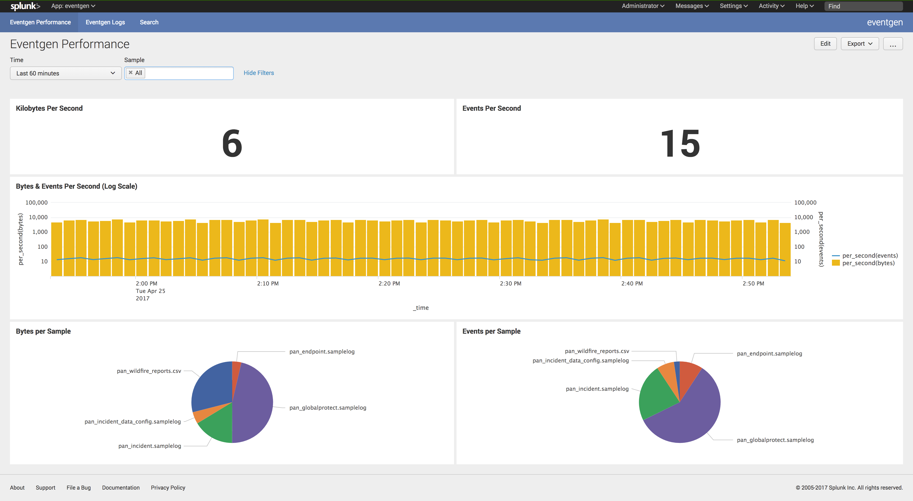

.. _trialdemo:

Trial and Demo
==============

Information on how to sample the Palo Alto Networks Splunk App and Add-on. 

Event Gen
---------

Event Gen is an app provided by Splunk in order to feed sample data into Splunk. 

The Event Gen app and documentation is available on Splunk Base

https://splunkbase.splunk.com/app/1924/

With Event Gen App installed and enabled with Palo Alto Networks App and Add-on, demo data will appear in the app.

