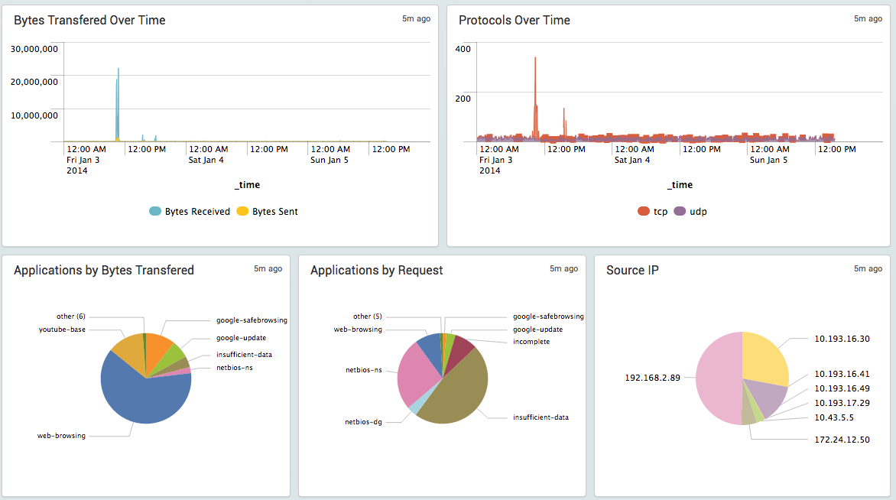

Troubleshooting
===============

Follow these troubleshooting steps if there are problems getting the
dashboards to show data.

**Step 1.  Check that all initial configuration is complete**

- Verify inputs.conf is set up per the instructions above
  inputs.conf must have the line "no_appending_timestamp = true"
- Check the other inputs.conf configurations for other inputs using the same
  port
- Check that the firewall is not using a Custom Log Format (must use default)
- Check that the firewall is set to log something like system events, config
  events, traffic events, and so on.
- Check that the clocks on the firewall and Splunk server are the same.  If
  they are different, logs will not show up correctly.
- If using a TCP or SSL port for syslogs, try UDP instead first, then switch
  to TCP or SSL once UDP is working

**Step 2.  Verify logs are indexed**

Use the method described in Test the configuration to produce some syslogs.
Verify the logs are reaching the Splunk server by navigating to the Splunk
for Palo Alto Networks app, click Search in the navigation bar, then enter::

    index=pan_logs

If no logs show up, then the logs are not getting indexed correctly. Use
these steps to find the problem:

- Verify the configuration from the Troubleshooting section above.
- Switch the search timeframe to All Time. If logs show up, verify the
  timestamp is correct on the logs. If time is wrong, check that the clocks
  on the Splunk server and firewall are the same.
- Use tcpdump or Wireshark on the Splunk server to verify the logs are
  actually reaching it. Also, verify that the pan_logs index exists.

**Step 3. Verify logs are parsed correctly**

Use the method described above in the section Test the configuration to
produce some syslogs. Verify the logs are reaching the Splunk server by
navigating to the Splunk for Palo Alto Networks app, click 'Search' in the
navigation bar, and enter the following search::

    index=pan_logs sourcetype=pan_config

If logs showed in step 2, but no logs show up now, then try
``sourcetype=pan_logs`` instead of ``sourcetype=pan_config``.  If the logs
start
showing up after that change, then the logs are not getting parsed correctly:

- Check that you are not using a Custom Log Format in the syslog server
  setting on the firewall.
- Check that the inputs.conf file is configured with the line
  "no_appending_timestamp = true"
- If you're using a third-party syslog forwarder between the Palo Alto
  Networks device and Splunk, verify the forwarder isn't modifying the logs.

**Step 4.  Check acceleration and summary indexing**

Check that the dashboards are populating with data. The Overview dashboard
doesn't use acceleration, so it should work at this point. If it doesn't
show data, then go back to troubleshooting. For all the other dashboards,
after 5-8 minutes of syslogging to the Splunk server, the dashboards should
populate with data. If the dashboards are populating, then acceleration and
summary indexing are working. If not, check the following:

App Version 4.0 and earlier:
  Uses TSIDX for acceleration.

- Verify that saved searches for log collection are in the savedsearches.conf
  file. Check that they haven't been changed or overwritten.

App Version 4.1 and later:
  Uses Data Model for acceleration.

- Check acceleration settings in the data model under Settings > Data Model >
  Palo Alto Networks Logs, then edit the Acceleration settings and verify
  they are enabled for a reasonably large timeframe.
- Click the arrow next to the Palo Alto Networks logs data model and check
  data model build percentage. It should be 100% or very close to it.
- If the build percentage is stuck at less than 90%, the cause might be
  limited resources on the Splunk server being consumed by other apps. Check
  if Splunk CIM or Splunk ES apps are running on the Splunk server. If they
  are, try disabling both apps, and see if the build percentage increases
  over 90%. If it does, open a case with Splunk support to report the
  resource contention issue between the apps and get advice on how to proceed.
