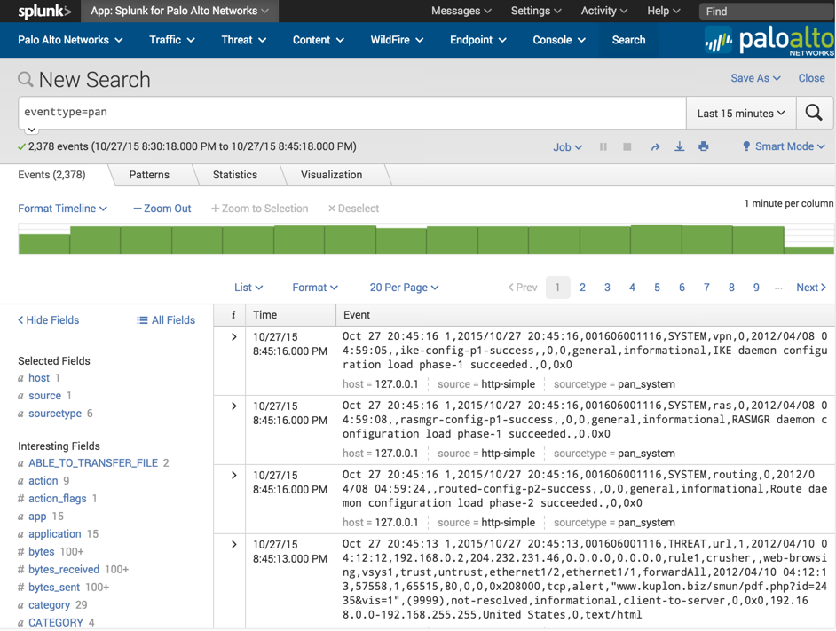
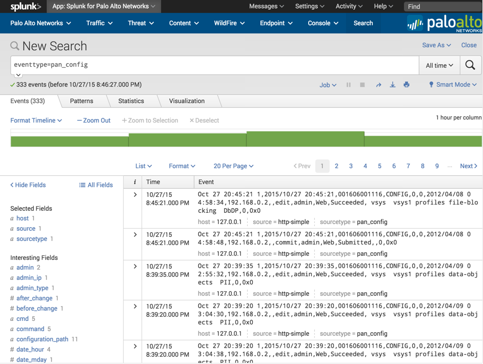

.. _troubleshoot:

Troubleshooting
===============

Follow these troubleshooting steps if there are problems getting the
dashboards to show data.

**Step 1.  Check that all initial configuration is complete**

- Verify inputs.conf is set up per the :ref:`instructions <datainput>`.
  inputs.conf must have the line ``no_appending_timestamp = true`` for UDP
  syslogs
- Check for other inputs.conf outside the App or Add-on that might be using
  the same port
- Check the firewall is not using a Custom Log Format (must use the
  default log format)
- Check the firewall is set to log something like system events, config
  events, traffic events, and so on.
- Check that the clocks and timezones on the firewall and Splunk server are
  the same.  If they are different, logs will not show up correctly.
- If using a TCP or SSL port for syslogs, try UDP instead, then switch
  to TCP or SSL once UDP is working

**Step 2.  Verify logs are indexed**

Use the method described in the :ref:`Test the configuration <test>` section
to produce some syslogs. Verify the logs are reaching the Splunk server by
navigating to the Splunk for Palo Alto Networks app, click 'Search' in the
navigation bar, then enter::

    eventtype=pan

If no logs show up, then the logs are not getting indexed correctly. Use
these steps to find the problem:

- Verify the configuration from Step 1 above.
- Switch the search timeframe to All Time. If logs show up, verify the
  timestamp is correct on the logs. If time is wrong, check that the Splunk
  server and firewall have the same time and timezone set. Use NTP if possible.
- Use tcpdump or Wireshark on the Splunk server to verify the logs are
  actually reaching it.
- Verify the App (and Add-on when using App v5.0 and higher) is installed on
  all searchheads, indexers, and heavy forwarders.
- If using App v3.x or 4.x, verify the pan_logs index exists.

**Step 3. Verify logs are parsed correctly**

Use the method described above in the :ref:`Test the configuration <test>`
section to produce some syslogs. Verify the logs are reaching the Splunk
server by navigating to the Palo Alto Networks App, click 'Search' in the
navigation bar, and enter the following search::

    eventtype=pan_config

If logs showed in step 2, but no logs show up now, then the logs are not
getting parsed correctly:

- Check that you are not using a Custom Log Format in the syslog server
  setting on the firewall.
- Check that the inputs.conf file is configured with the line
  "no_appending_timestamp = true" if using UDP syslogs.
- If you're using a third-party syslog forwarder between the Palo Alto
  Networks device and Splunk, verify the forwarder isn't modifying the logs.
- Verify the App (and Add-on when using App v5.0 and higher) is installed on
  all searchheads, indexers, and heavy forwarders.

**Step 4.  Check acceleration and summary indexing**

.. image:: _static/troubleshooting_dashboard.png

Check that the dashboards are populating with data. The Overview dashboard
doesn't use acceleration, so it should work at this point. If it doesn't,
then go back to the previous troubleshooting steps. For all the other
dashboards, after 5-8 minutes of syslogging to the Splunk server, the
dashboards should populate with data. If the dashboards are populating,
then acceleration and summary indexing are working. If not, check the
following:

App Version 4.0 and earlier:
  Uses TSIDX for acceleration.

- Verify that saved searches for log collection are in the savedsearches.conf
  file. Check that they haven't been changed or overwritten.

App Version 4.1 and later:
  Uses Data Model for acceleration.

- Check acceleration settings in the data model under Settings > Data Model >
  and fine the Palo Alto Networks datamodels. (There may be 1 or 3 datamodels
  depending on the App version)
- Verify that acceleration is enabled for all Palo Alto Networks datamodels.
- Click the arrow next to the Palo Alto Networks data models and check the
  data model build percentage. It should be 100% or very close to it.
- If the build percentage is stuck at less than 90%, the cause might be
  limited resources on the Splunk server being consumed by other apps. Try
  disableing unused apps, removing acceleration from other datamodels,
  or adding hardware resources. If you need help troubleshooting performance
  problems with datamodels, you can open a case with Splunk Support. Note
  that Splunk Support will not troubleshoot the Palo Alto Networks App, but
  they can tell you what is causing any performance problems that prevent
  your datamodels from accelerating fast enough to keep up with new data.

**Step 5.  Get support**

If you get to the end of these troubleshooting steps and you still can't figure
out what's wrong, please search `Splunk Answers`_ or ask a question using the
information on the :ref:`getsupport` page.

.. _Splunk Answers: https://answers.splunk.com/app/questions/491.html
