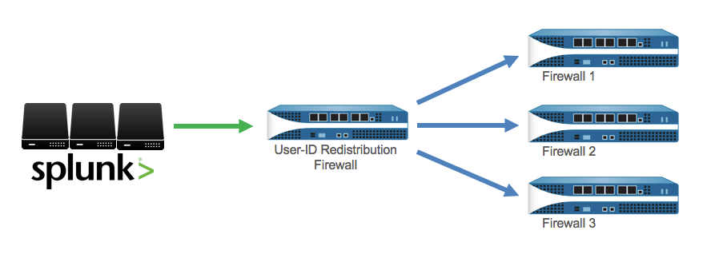

User-ID with Splunk
===================

The Palo Alto Networks firewall will inform Splunk of the user generating
each connection or event via the syslogs it sends to Splunk.  This assumes
that the firewall is getting the login information from AD or some other
authentication system, to know what user is logged into the device
generating the traffic.

If authentication logs are being indexed by Splunk, then Splunk can synchronize
knowledge of where users are logged in with the firewall. There are two ways
to synchronize user-id information to the firewall, depending on how your
authentication logs are formatted in Splunk.

Method 1: Splunk Forwarding
---------------------------

This is the **recommended** method.

Forward the authentication logs from Splunk to a User-ID Agent or User-ID
Firewall. The logs must contain both the user and the IP address where they
logged in/out.

This method is recommended because it is more efficient.

**Step 1: Configure log forwarding on Splunk**
http://docs.splunk.com/Documentation/Splunk/6.3.0/Forwarding/Forwarddatatothird-partysystemsd

**Step 2: Configure syslog receiving on User-ID firewall/agent**
https://www.paloaltonetworks.com/documentation/70/pan-os/pan-os/user-id/configure-user-id-to-receive-user-mappings-from-a-syslog-sender.html

Method 2: Searchbar Command
---------------------------

Use the ``panuserupdate`` command that is included with the app.

For this method, the logs are not required to contain both the user and ip
in the same log. For example, where there is an authentication log with user
and MAC address, and a DHCP log with MAC address and IP address.  Splunk
can do a search correlating the user to the IP using the MAC as the common
value, then pass the search results to the ``panuserupdate`` command which
will update the mapping on the firewall.

See :ref:`panuserupdate` in the Searchbar Command documentation.

Distribute User-ID
------------------

To simplify administration, you can configure one firewall to be the
redistribution firewall that collects all the mapping information and
shares it with other firewalls. You configure the receiving firewalls to
retrieve the mapping information from the redistribution firewall; they
don’t need to communicate directly with domain servers.

**Configure a Firewall to Share User Mapping Data with Other Firewalls**
https://www.paloaltonetworks.com/documentation/70/pan-os/pan-os/user-id/configure-a-firewall-to-share-user-mapping-data-with-other-firewalls.html